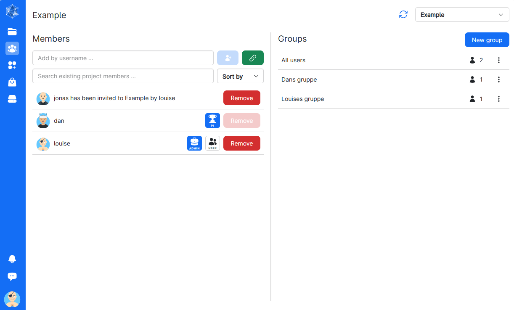
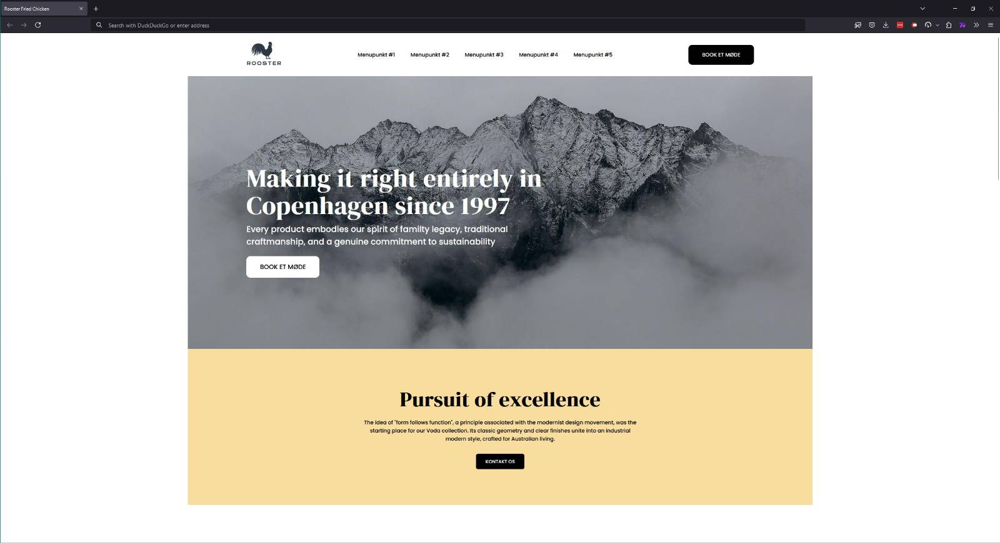
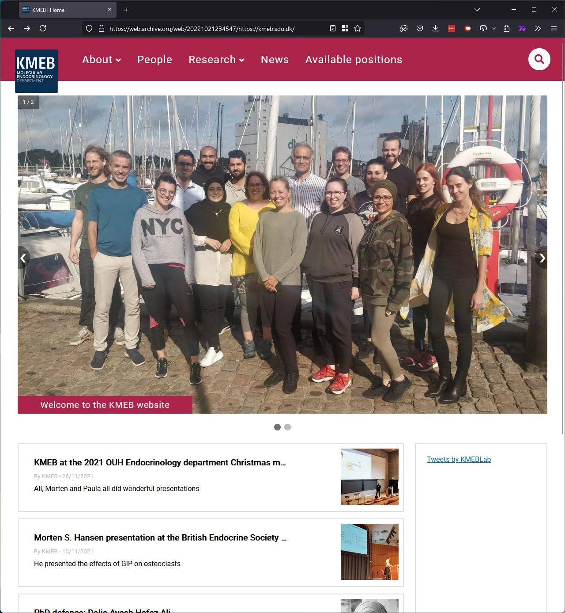
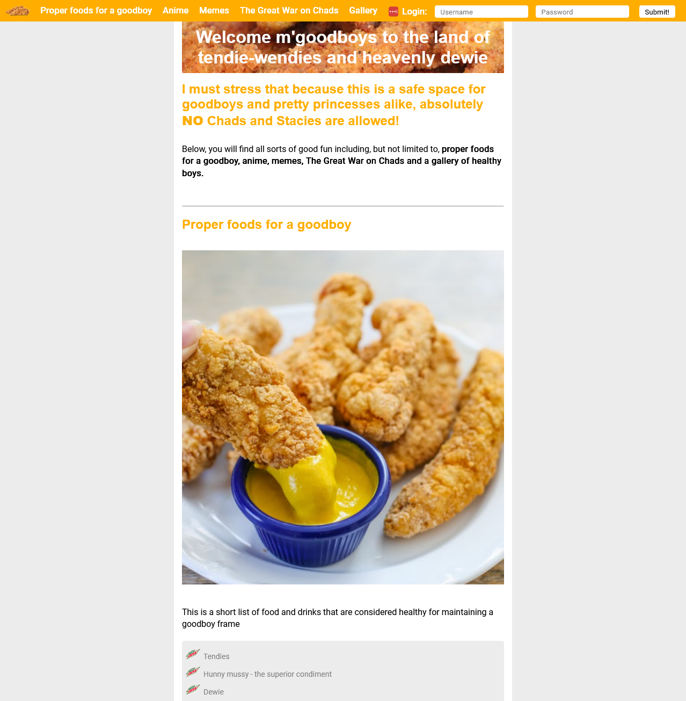

### Hi there 👋

#### Introduction

I am a highly motivated person with a strong academic background. I am looking for a career change into a role with the IT sector, where I can utilize my skill set positively, drive innovation within the field and exercise my passion for programming. 

#### Technologies I have worked with

- Frontend: JavaScript, TypeScript, React, HTML, CSS
- Backend: Kotlin
- Scientific computing: R, Conda, Linux, Bash, Git

#### Past projects

Here is a highlight of some of my projects

| Screenshot | Description |
|------------|-------------|
|  | **UCloud** - TypeScript and React. During an internship at SDU eScience center, I worked on their cloud platform. For this I made a page dealing with project management, which made it into production. This page was developed using TypeScript and React and interacted with several REST APIs. |
|  | **Case mockup** - Responsive webpage mockup in HTML and CSS. In this project, I put great emphasis on responsiveness, making it compatible with multiple devices (different phones and tablets) and screen resolutions. Flexbox was also used extensively in this project. |
|  | **KMEB.sdu.dk** - former live static responsive website in HTML and CSS. In collaboration with stakeholders, I designed and developed this website from scratch. I also created a simple Kotlin backend for content management, deployed the site to a Linux server, and managed its content. Additionally, I monitored the website's performance, including reach and raw metrics, using Google Search Console, and optimized the site based on this data. |
|  | **Hacktoberfest** - A comedic side project made for Hacktoberfest, a static website in HTML and CSS, showing a fictional character’s love for chicken tenders, honey mustard and Mountain Dew. The subsequent year I reimplemented the site with a Kotlin backend using Ktor and kotlinx.HTML for writing HTML and CSS. |

#### Current project

Currently, I am working on a project where I am making a functional mockup for a live streaming platform using TypeScript and React.
